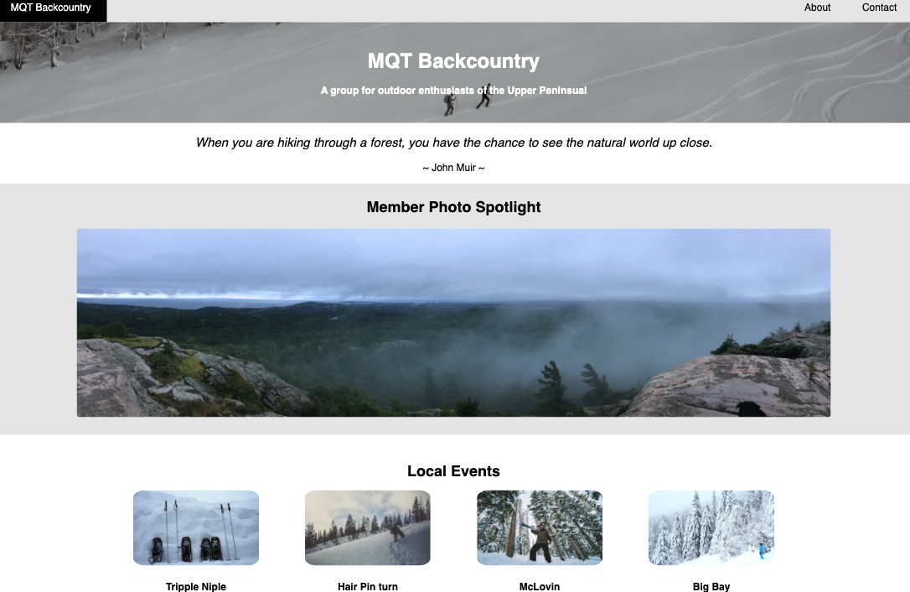

# MQT Backcountry
> This project was designed to demonstate the use of CSS Grid layout to form a responsive multiple page website for an outdoor club.

## Table of contents
* [General info](#general-info)
* [Screenshots](#screenshots)
* [Technologies](#technologies)
* [Setup](#setup)
* [Features](#features)
* [Status](#status)
* [Inspiration](#inspiration)
* [Contact](#contact)

## General info
> I designed the project with the intention displaying a responsive website with the use of CSS Grid. In addition, this project also utilizes JavaScript to randomly generate a John Muir quote each time the home page is loaded/refreshed. JS was also used to create a slide show of member photos that changes every five seconds.

## Screenshots


## Technologies
* HTML
* CSS
* JavaScript

## Setup
Please follow link to website - https://manovak24.github.io/mqt_backcountry/

## Code Examples
```js
let carousel = document.getElementById('slide')

let i = 0;
let images = [];
let time = 5000;

images[0] = './Resources/pano1.jpeg';
images[1] = './Resources/pano2.jpeg';
images[2] = './Resources/pano3.jpeg';
images[3] = './Resources/pano4.jpeg';

function changeImg() { 
    carousel.src = images[i];

    if (i < images.length -1) {
        i++;
    } else {
        i = 0;
    }

    setTimeout("changeImg()", time);
}

window.onload = changeImg;
```

## Features
List of features ready and TODOs for future development
* Random quote selected on page load/reload
* Member Spotlight Photo


## Status
Project is: _in progress_

## Inspiration
This site was inspired by my love for the local outdoor activites of Marquette, MI.

## Contact
Created by [@manovak24](https://github.com/manovak24) - feel free to contact me!